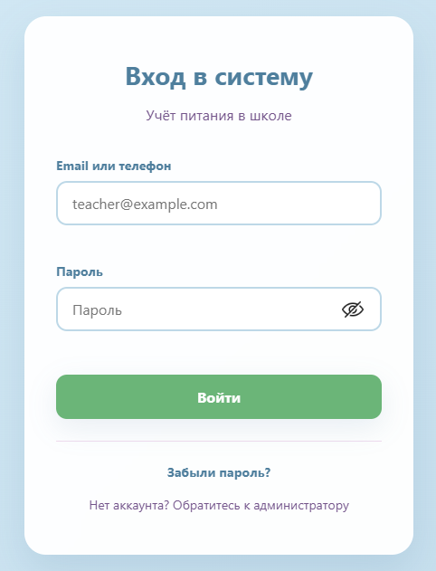
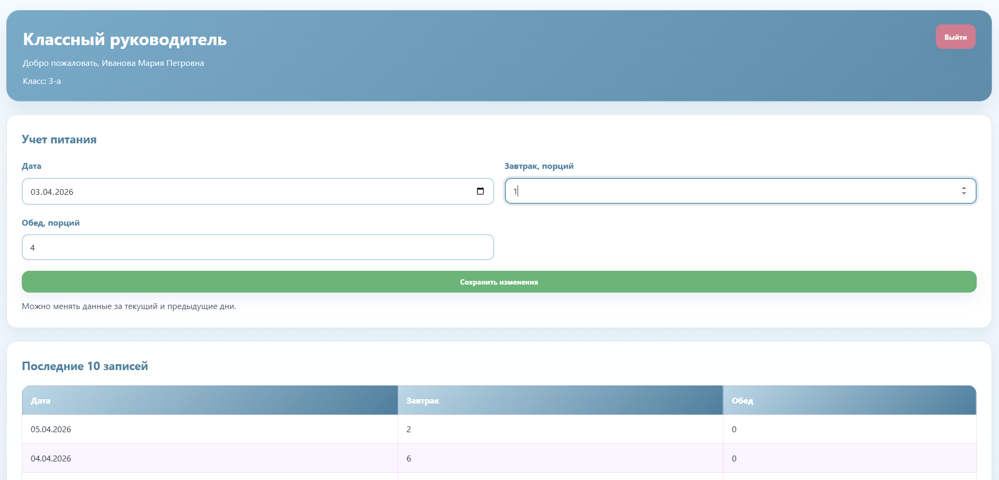
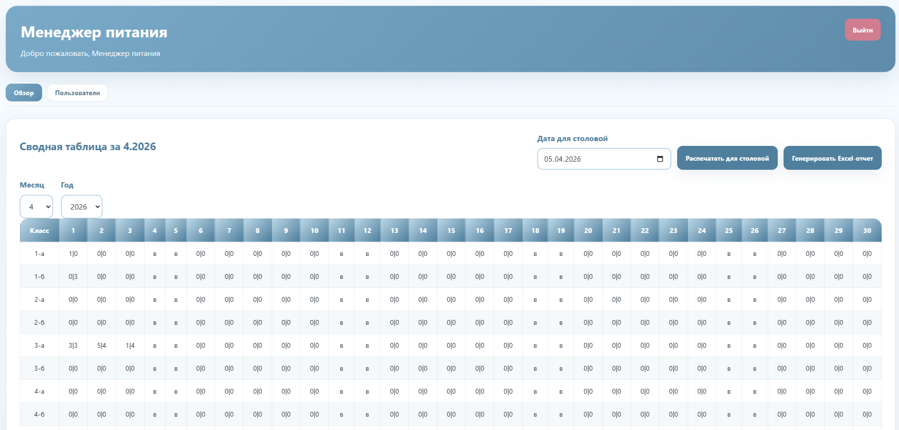
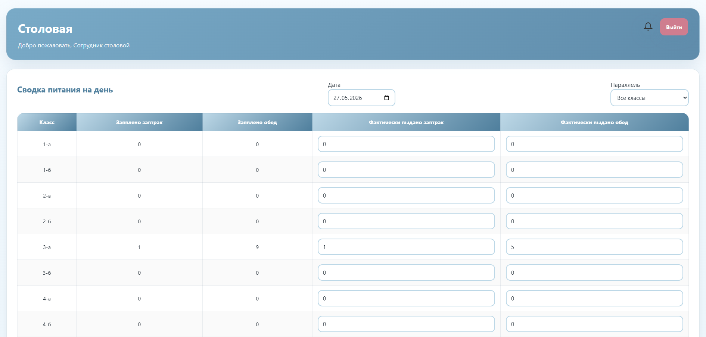

# 🍽️ School Meal Tracker

<p align="center">
  
  
  
  
  
  
  
</p>

---

## ✨ Краткое описание

School Meal Tracker — практичное веб-приложение для учёта горячего питания в школе-интернате. Автоматизирует сбор заявок, учёт фактической выдачи и формирование табелей с аналитикой.

---

## ⚙️ Основные возможности

- ✅ Аутентификация и разграничение прав (JWT, роли).  
- ✅ Управление классами (добавление, редактирование, удаление, сортировка).  
- ✅ Управление пользователями (операции доступные менеджеру).  
- ✅ Подача заявок на питание (завтрак / обед) с учётом выходных и праздников.  
- ✅ Сводная таблица менеджера — просмотр и правка заявок по дням.  
- ✅ Экспорт табеля в Excel (форматирование, итоги).  
- ✅ Печатная форма для столовой (отдельное окно, авто-печать).  
- ✅ Аналитика: линейные графики, топ классов, сравнение по периодам.  
- ✅ Журнал изменений (аудит) с фильтрами и русскими метками полей.  
- ✅ Внутренние уведомления (колокольчик, браузерные тосты, без внешней почты).  
- ✅ Адаптивный дизайн для мобильных и десктопных устройств.

---

## 👥 Роли пользователей

| Роль | Email | Пароль |
|------|-------|--------|
| Менеджер | `manager@example.com` | `manager123` |
| Классный руководитель | `class_teacher@example.com` | `teacher123` |
| Столовая | `canteen@example.com` | `canteen123` |

---

## 🧰 Технологии

### Frontend
- React  
- TypeScript  
- react-router-dom  
- recharts  
- react-icons  

### Backend
- Node.js  
- Express  
- SQLite  
- JWT (авторизация)

### Отчёты
- ExcelJS (генерация табелей)  
- Печатная форма отчётов

---

## 🚀 Установка и запуск

Установите зависимости:

```bash
npm install
```

Запустите frontend + backend в режиме разработки:

```bash
npm run dev
```

**Локальные адреса:**

- Frontend: `http://localhost:3000`  
- Backend API: `http://localhost:4000`

---

## 🖼️ Скриншоты интерфейса

<table>
  <tr>
    <td align="center" width="50%">
      
      <br /><strong>🔐 Экран входа</strong>
    </td>
    <td align="center" width="50%">
      
      <br /><strong>👩‍🏫 Панель учителя</strong>
    </td>
  </tr>
  <tr>
    <td align="center" width="50%">
      
      <br /><strong>📊 Панель менеджера</strong>
    </td>
    <td align="center" width="50%">
      
      <br /><strong>🍽️ Панель столовой</strong>
    </td>
  </tr>
</table>

---

## 📁 Структура проекта

- src — frontend (React + TypeScript)  
- server — backend (Express + SQLite)  
- screenshots — интерфейсные скриншоты (пути в README)  
- package.json — npm-скрипты и зависимости
